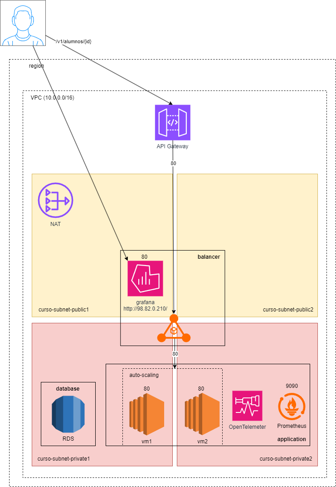

# Configuración de Arquitectura en AWS

Este archivo describe cómo configurar la arquitectura mostrada en el archivo `esquema.png` utilizando servicios de AWS.

## Imagen de Referencia

La imagen `esquema.png` muestra la arquitectura propuesta para desplegar la aplicación en AWS.

<div style="text-align: center;">
  
</div>

## Servicios Utilizados

La arquitectura utiliza los siguientes servicios de AWS:

1. **Elastic Load Balancer (ELB)**: Para distribuir el tráfico entre las instancias de la aplicación.
2. **Auto Scaling Group (ASG)**: Para gestionar la escalabilidad de las instancias EC2.
3. **Amazon EC2**: Para alojar la aplicación Spring Boot.
4. **Amazon RDS**: Para la base de datos MySQL.
5. **VPC**: Para la red privada que contiene los recursos.
6. **NAT Gateway**: Para permitir que las subredes privadas tengan salida a Internet.
7. **Elastic IP**: Asociada al NAT Gateway para proporcionar una dirección IP pública fija.
8. **Security Groups**: Para controlar el tráfico entrante y saliente entre los recursos de la arquitectura.
9. **Launch Template**: Para definir la configuración de las instancias EC2, incluyendo el Security Group `application` y el script de User Data para configurar Docker, levantar la aplicación y establecer las variables de entorno necesarias para OpenTelemetry.
10. **Target Group**: Para asociar las instancias EC2 al Application Load Balancer (ALB) y configurar un Health Check en el path `/actuator/health` para monitorear el estado de las instancias.
11. **API Gateway**: Para exponer un endpoint HTTP que redirige las solicitudes al Application Load Balancer (ALB) y facilita la integración con clientes externos.

## Pasos para Configurar la Arquitectura

### 1. Configurar la VPC

1. Crea una VPC con subredes públicas y privadas.
2. Configura una tabla de enrutamiento para permitir el acceso a Internet desde las subredes públicas.
3. Configura un **NAT Gateway** en una subred pública y asócialo a una **Elastic IP** para permitir que las subredes privadas tengan salida a Internet [`01 - nat-gateway.png`].
4. Actualiza la tabla de enrutamiento de las subredes privadas para redirigir el tráfico de salida a través del NAT Gateway [`02 - subnets.png`].

<div style="text-align: center;">
  
</div>

<div style="text-align: center;">
  
</div>

### 2. Configurar los Security Groups

1. **Security Group para el API Gateway (`apigateway`)**:
   - **Reglas de entrada**: No tiene reglas de entrada configuradas.
   - **Reglas de salida**: Permite tráfico saliente desde el balanceador en el puerto `80`.
   - **Asociación**: Este Security Group se asocia al API Gateway.

2. **Security Group para la base de datos (`database`)**:
   - **Reglas de entrada**: Permite conexiones entrantes en el puerto `3306` (MySQL) únicamente desde el Security Group `application`.
   - **Reglas de salida**: Permite cualquier tráfico de salida.
   - **Asociación**: Este Security Group se asocia al Amazon RDS.

3. **Security Group para las aplicaciones (`application`)**:
   - **Reglas de entrada**:
     - Permite tráfico entrante en el puerto `80` desde el Security Group `balancer`.
     - Permite cualquier conexión TCP entre miembros del mismo grupo.
   - **Reglas de salida**: Permite cualquier tráfico de salida.
   - **Asociación**: Este Security Group se asocia a las instancias EC2 creadas para el target group, una instancia de OpenTelemetry y una instancia de Prometheus.

4. **Security Group para el balanceador (`balancer`)**:
   - **Reglas de entrada**: Permite tráfico entrante en el puerto `80` desde cualquier origen.
   - **Reglas de salida**: Permite cualquier tráfico de salida.
   - **Asociación**: Este Security Group se asocia al Application Load Balancer (ALB).

Asegúrate de configurar correctamente cada Security Group y asociarlo a los recursos correspondientes para garantizar el correcto funcionamiento de la arquitectura [`03 - security-groups.png`].

<div style="text-align: center;">
  
</div>

### 3. Configurar la Base de Datos (RDS)

1. Crea una instancia de Amazon RDS con MySQL como motor de base de datos [`04 - rds.png`].
2. Selecciona las subredes privadas de la VPC para alojar la instancia RDS.
3. Asocia el Security Group `database` a la instancia RDS para controlar el acceso.
4. Configura las credenciales de acceso (usuario y contraseña).

<div style="text-align: center;">
  
</div>

### 4. Configurar el Launch Template

1. Crea un **Launch Template** para las instancias EC2 con las siguientes configuraciones:
   - **Security Group**: Asocia el Security Group `application` para controlar el tráfico entrante y saliente.
   - **User Data**: Incluye un script para configurar Docker, levantar la aplicación y configurar las variables de entorno necesarias para OpenTelemetry. Ejemplo de User Data [`05 - launch-template.png`]:
     ```bash
        #! /bin/sh
        apt update -y
        apt install docker.io -y
        usermod -a -G docker ubuntu
        curl -L https://github.com/docker/compose/releases/download/v2.3.0/docker-compose-`uname -s`-`uname -m` > /usr/local/bin/docker-compose
        chmod +x /usr/local/bin/docker-compose
        chown root:docker /usr/local/bin/docker-compose
        cat << EOF > /home/ubuntu/docker-compose.yml
        services:
        apialumnos:
            image: jcabrera9409/aws-test:1.1-java-agent
            environment: 
            - HOST_BD={HOST_BD}
            - PORT_BD=3306
            - NAME_BD=testdb
            - USER_BD={USER_BD}
            - PASSWORD_BD={PASSWORD_BD}
            - OTEL_SERVICE_NAME=apialumnos
            - OTEL_EXPORTER_OTLP_ENDPOINT=http://{PRIVATE_IP}:4318
            ports:
            - "80:8080"
            restart: on-failure
        EOF
        chown ubuntu:ubuntu /home/ubuntu/docker-compose.yml
        /usr/local/bin/docker-compose -f /home/ubuntu/docker-compose.yml up -d
     ```

<div style="text-align: center;">
  
</div>

### 5. Configurar el Target Group

1. Crea un Target Group para el Application Load Balancer (ALB) [`06 - target-groups.png`].
2. Configura el **Health Check**:
   - **Protocolo**: HTTP.
   - **Path**: `/actuator/health`.
   - **Puerto**: 80.
3. Ajusta los parámetros del Health Check según sea necesario, como:
   - Intervalo de comprobación: 30 segundos.
   - Umbral de éxito: 3 intentos consecutivos exitosos.
   - Umbral de fallo: 2 intentos consecutivos fallidos.

<div style="text-align: center;">
  
</div>

### 6. Configurar el Auto Scaling Group (ASG)

1. Crea un Auto Scaling Group utilizando el **Launch Template** con la versión por defecto.
2. Configura el **Security Group** `application` para las instancias EC2 lanzadas por el ASG.
3. Establece la capacidad deseada en `2` instancias, con un mínimo de `0` y un máximo de `4` instancias.
4. Asocia el Auto Scaling Group con las **subredes privadas** de la VPC para garantizar que las instancias estén protegidas y no sean accesibles directamente desde Internet.
5. Asocia el Auto Scaling Group a un **Target Group** previamente configurado para que las instancias EC2 sean monitoreadas y reciban tráfico del Application Load Balancer (ALB) [`07 - auto-scaling-groups.png`].

<div style="text-align: center;">
  
</div>

### 7. Configurar el Load Balancer

1. Crea una regla en el Application Load Balancer (ALB) para redirigir el tráfico [`08 - load-balancer.png`]: 
   - **Condición**: Cualquier solicitud con el path que coincida con `/v1/alumnos*`.
   - **Acción**: Enviar el tráfico al Target Group previamente configurado.

<div style="text-align: center;">
  
</div>

### 8. Configurar el API Gateway

1. Crea un API Gateway de tipo **HTTP API** [`09 - api-gateway.png`].
2. Configura una integración con el Application Load Balancer (ALB) previamente creado.
3. Define el **Stage Name** como `$default` para que todas las solicitudes dirigidas al dominio raíz del API Gateway sean redirigidas al ALB.
4. Asegúrate de que el API Gateway esté asociado al Security Group `apigateway` para controlar el tráfico saliente hacia el ALB.

<div style="text-align: center;">
  
</div>

### 9. Configurar Instancias EC2 para OpenTelemetry, Prometheus y Grafana

1. **Instancia EC2 para OpenTelemetry** [`10 - opentelemeter.png`]:
   - **Red**: Subred privada.
   - **Security Group**: `application`.
   - **Propósito**: Actuar como colector de trazas y métricas para la aplicación.

<div style="text-align: center;">
  
</div>

2. **Instancia EC2 para Prometheus** [`11 - prometheus.png`]:
   - **Red**: Subred privada.
   - **Security Group**: `application`.
   - **Propósito**: Monitorear métricas de la aplicación y del colector OpenTelemetry.

<div style="text-align: center;">
  
</div>

3. **Instancia EC2 para Grafana** [`12 - grafana.png`]:
   - **Red**: Subred pública.
   - **Security Groups**: 
     - `application`: Para permitir la comunicación con Prometheus.
     - `balancer`: Para permitir peticiones desde Internet en el puerto `80`.
   - **Propósito**: Visualizar métricas y trazas recolectadas por Prometheus y OpenTelemetry.

<div style="text-align: center;">
  
</div>

## Autor
Proyecto desarrollado por Jose Cabrera.